# End-to-End Flow Diagrams (Mermaid) — Rusuh Booking Tiket

All user journeys with complete service interactions in Mermaid format.

---

## 1. Master Flow Overview

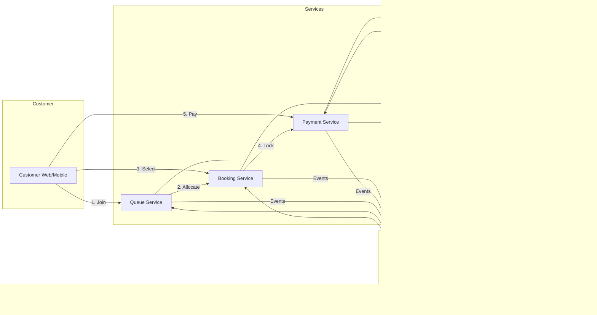
```mermaid
flowchart LR
    subgraph Customer
        C[Customer Web/Mobile]
    end
    
    subgraph Services
        Q[Queue Service]
        B[Booking Service]
        P[Payment Service]
        N[Notification Service]
        U[User Service]
    end
    
    subgraph External
        M[Midtrans]
        S[SMTP/SES]
        F[FCM Push]
    end
    
    subgraph Data
        PG[(PostgreSQL)]
        VK[(Valkey)]
        MQ[(RabbitMQ)]
    end
    
    C -->|1. Join| Q
    C -->|3. Select| B
    C -->|5. Pay| P
    
    Q -->|2. Allocate| B
    B -->|4. Lock| P
    P -->|Charge| M
    M -->|Webhook| P
    
    B -->|Events| MQ
    P -->|Events| MQ
    Q -->|Events| MQ
    MQ --> N
    MQ --> Q
    MQ --> B
    
    N --> S
    N --> F
    
    Q --> VK
    B --> PG
    P --> PG
    N --> PG
    U --> PG
    U --> VK
```

---

## 2. Journey J-01: Happy Path — Purchase to Ticket

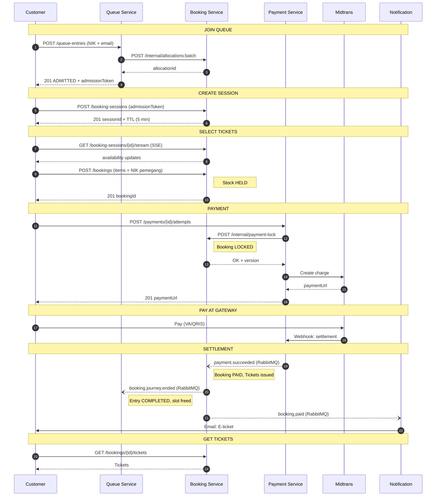
```mermaid
sequenceDiagram
    autonumber
    participant C as Customer
    participant Q as Queue Service
    participant B as Booking Service
    participant P as Payment Service
    participant M as Midtrans
    participant N as Notification
    
    Note over C,N: JOIN QUEUE
    C->>Q: POST /queue-entries (NIK + email)
    Q->>B: POST /internal/allocations:batch
    B-->>Q: allocationId
    Q-->>C: 201 ADMITTED + admissionToken
    
    Note over C,N: CREATE SESSION
    C->>B: POST /booking-sessions (admissionToken)
    B-->>C: 201 sessionId + TTL (5 min)
    
    Note over C,N: SELECT TICKETS
    C->>B: GET /booking-sessions/{id}/stream (SSE)
    B-->>C: availability updates
    C->>B: POST /bookings (items + NIK pemegang)
    Note right of B: Stock HELD
    B-->>C: 201 bookingId
    
    Note over C,N: PAYMENT
    C->>P: POST /payments/{id}/attempts
    P->>B: POST /internal/payment-lock
    Note right of B: Booking LOCKED
    B-->>P: OK + version
    P->>M: Create charge
    M-->>P: paymentUrl
    P-->>C: 201 paymentUrl
    
    Note over C,N: PAY AT GATEWAY
    C->>M: Pay (VA/QRIS)
    M->>P: Webhook: settlement
    
    Note over C,N: SETTLEMENT
    P--)B: payment.succeeded (RabbitMQ)
    Note right of B: Booking PAID, Tickets issued
    B--)Q: booking.journey.ended (RabbitMQ)
    Note right of Q: Entry COMPLETED, slot freed
    B--)N: booking.paid (RabbitMQ)
    N->>C: Email: E-ticket
    
    Note over C,N: GET TICKETS
    C->>B: GET /bookings/{id}/tickets
    B-->>C: Tickets
```

---

## 3. Journey J-02: Sold Out While Waiting

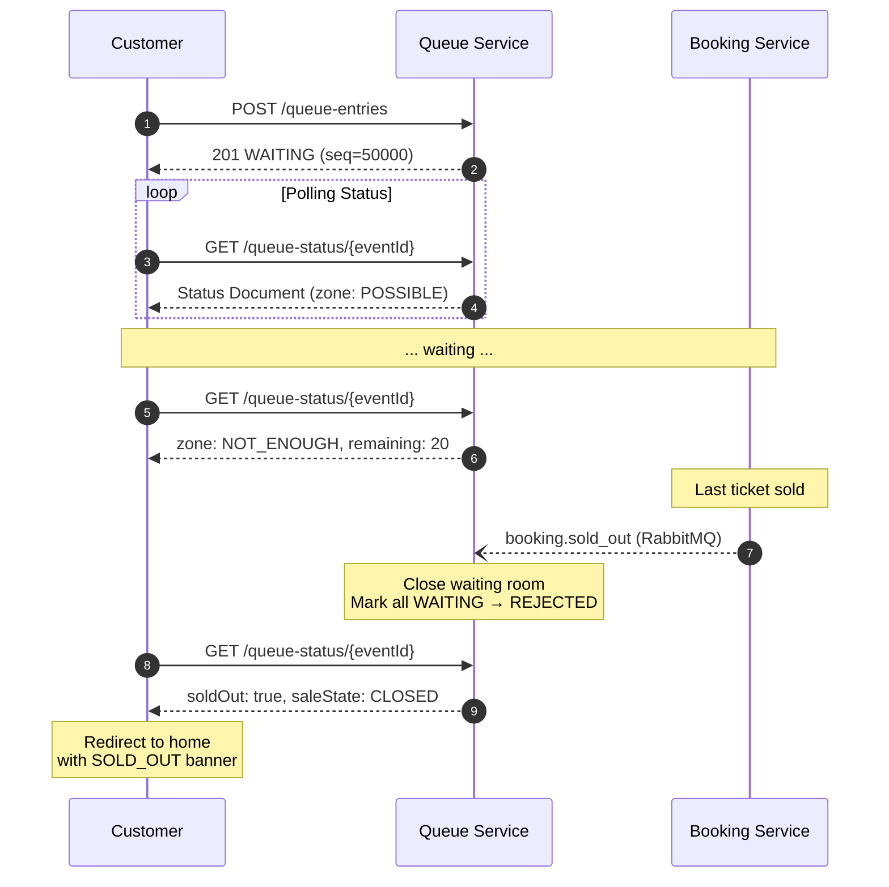
```mermaid
sequenceDiagram
    autonumber
    participant C as Customer
    participant Q as Queue Service
    participant B as Booking Service
    
    C->>Q: POST /queue-entries
    Q-->>C: 201 WAITING (seq=50000)
    
    loop Polling Status
        C->>Q: GET /queue-status/{eventId}
        Q-->>C: Status Document (zone: POSSIBLE)
    end
    
    Note over C,B: ... waiting ...
    
    C->>Q: GET /queue-status/{eventId}
    Q-->>C: zone: NOT_ENOUGH, remaining: 20
    
    Note over B: Last ticket sold
    B--)Q: booking.sold_out (RabbitMQ)
    
    Note over Q: Close waiting room<br/>Mark all WAITING → REJECTED
    
    C->>Q: GET /queue-status/{eventId}
    Q-->>C: soldOut: true, saleState: CLOSED
    
    Note over C: Redirect to home<br/>with SOLD_OUT banner
```

---

## 4. Journey J-03: Turn Missed (Claim Expired)

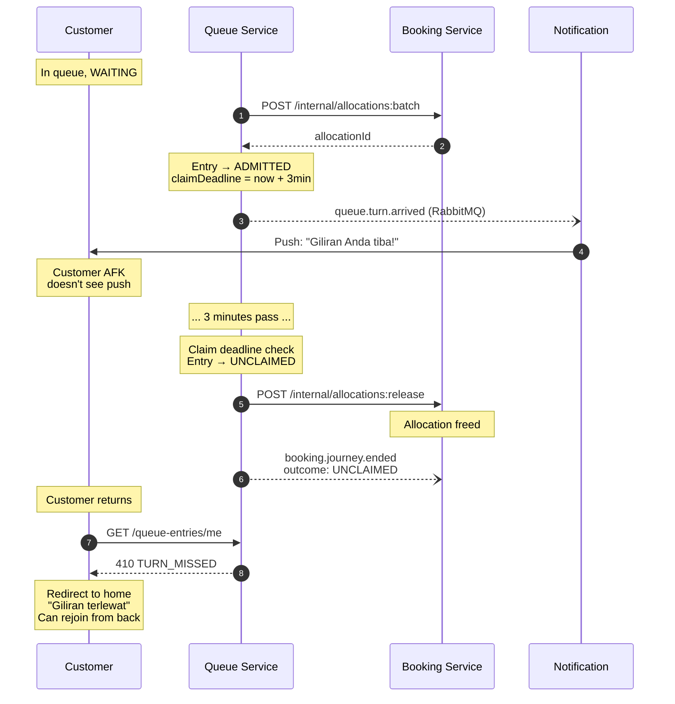
```mermaid
sequenceDiagram
    autonumber
    participant C as Customer
    participant Q as Queue Service
    participant B as Booking Service
    participant N as Notification
    
    Note over C: In queue, WAITING
    
    Q->>B: POST /internal/allocations:batch
    B-->>Q: allocationId
    Note over Q: Entry → ADMITTED<br/>claimDeadline = now + 3min
    
    Q--)N: queue.turn.arrived (RabbitMQ)
    N->>C: Push: "Giliran Anda tiba!"
    
    Note over C: Customer AFK<br/>doesn't see push
    
    Note over Q: ... 3 minutes pass ...
    
    Note over Q: Claim deadline check<br/>Entry → UNCLAIMED
    
    Q->>B: POST /internal/allocations:release
    Note over B: Allocation freed
    
    Q--)B: booking.journey.ended<br/>outcome: UNCLAIMED
    
    Note over C: Customer returns
    C->>Q: GET /queue-entries/me
    Q-->>C: 410 TURN_MISSED
    
    Note over C: Redirect to home<br/>"Giliran terlewat"<br/>Can rejoin from back
```

---

## 5. Journey J-04a: Payment Expired (Not Paid)

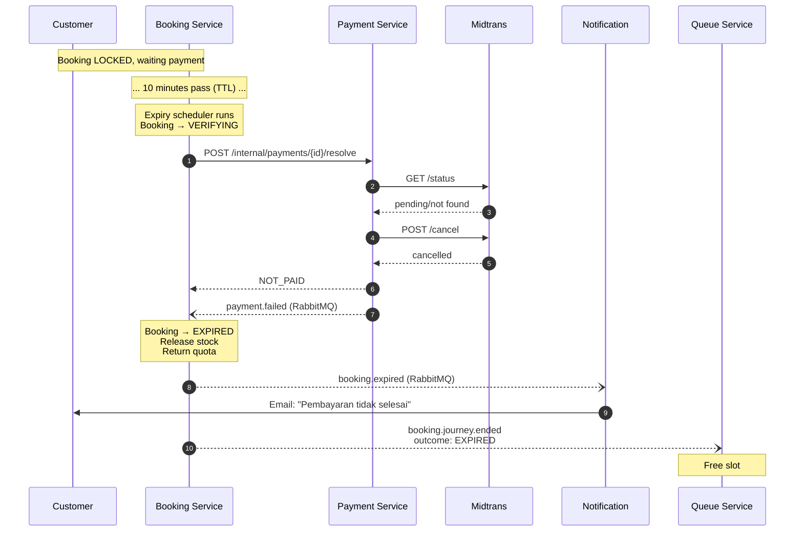
```mermaid
sequenceDiagram
    autonumber
    participant C as Customer
    participant B as Booking Service
    participant P as Payment Service
    participant M as Midtrans
    participant N as Notification
    participant Q as Queue Service
    
    Note over C,B: Booking LOCKED, waiting payment
    
    Note over B: ... 10 minutes pass (TTL) ...
    
    Note over B: Expiry scheduler runs<br/>Booking → VERIFYING
    
    B->>P: POST /internal/payments/{id}/resolve
    P->>M: GET /status
    M-->>P: pending/not found
    P->>M: POST /cancel
    M-->>P: cancelled
    P-->>B: NOT_PAID
    
    P--)B: payment.failed (RabbitMQ)
    
    Note over B: Booking → EXPIRED<br/>Release stock<br/>Return quota
    
    B--)N: booking.expired (RabbitMQ)
    N->>C: Email: "Pembayaran tidak selesai"
    
    B--)Q: booking.journey.ended<br/>outcome: EXPIRED
    Note over Q: Free slot
```

---

## 6. Journey J-04b: Late Payment (After Deadline)

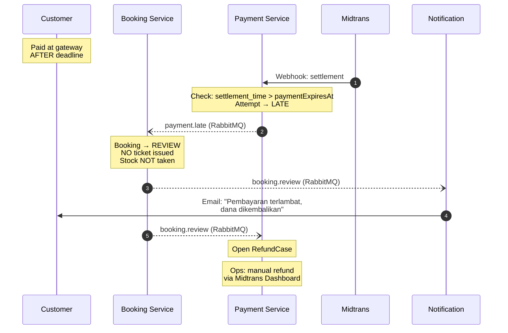
```mermaid
sequenceDiagram
    autonumber
    participant C as Customer
    participant B as Booking Service
    participant P as Payment Service
    participant M as Midtrans
    participant N as Notification
    
    Note over C: Paid at gateway<br/>AFTER deadline
    
    M->>P: Webhook: settlement
    
    Note over P: Check: settlement_time > paymentExpiresAt<br/>Attempt → LATE
    
    P--)B: payment.late (RabbitMQ)
    
    Note over B: Booking → REVIEW<br/>NO ticket issued<br/>Stock NOT taken
    
    B--)N: booking.review (RabbitMQ)
    N->>C: Email: "Pembayaran terlambat,<br/>dana dikembalikan"
    
    B--)P: booking.review (RabbitMQ)
    Note over P: Open RefundCase
    
    Note over P: Ops: manual refund<br/>via Midtrans Dashboard
```

---

## 7. Journey J-05a: Refresh During Selection

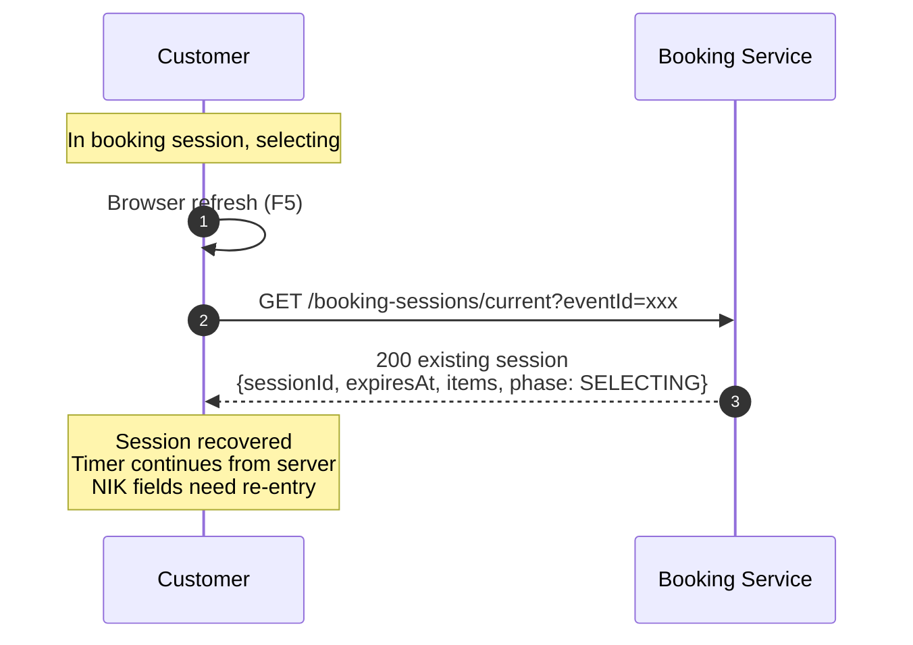
```mermaid
sequenceDiagram
    autonumber
    participant C as Customer
    participant B as Booking Service
    
    Note over C: In booking session, selecting
    
    C->>C: Browser refresh (F5)
    
    C->>B: GET /booking-sessions/current?eventId=xxx
    B-->>C: 200 existing session<br/>{sessionId, expiresAt, items, phase: SELECTING}
    
    Note over C: Session recovered<br/>Timer continues from server<br/>NIK fields need re-entry
```

---

## 8. Journey J-05b: Back Button After Lock

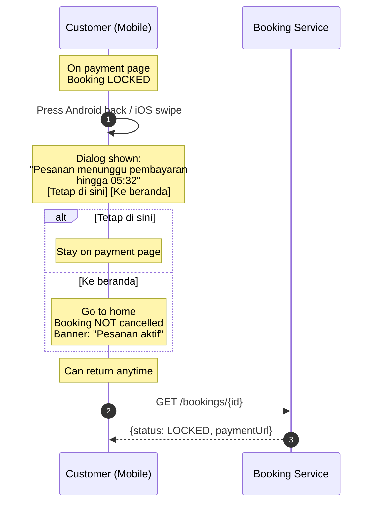
```mermaid
sequenceDiagram
    autonumber
    participant C as Customer (Mobile)
    participant B as Booking Service
    
    Note over C: On payment page<br/>Booking LOCKED
    
    C->>C: Press Android back / iOS swipe
    
    Note over C: Dialog shown:<br/>"Pesanan menunggu pembayaran<br/>hingga 05:32"<br/>[Tetap di sini] [Ke beranda]
    
    alt Tetap di sini
        Note over C: Stay on payment page
    else Ke beranda
        Note over C: Go to home<br/>Booking NOT cancelled<br/>Banner: "Pesanan aktif"
    end
    
    Note over C: Can return anytime
    C->>B: GET /bookings/{id}
    B-->>C: {status: LOCKED, paymentUrl}
```

---

## 9. Journey J-05c: Connection Lost

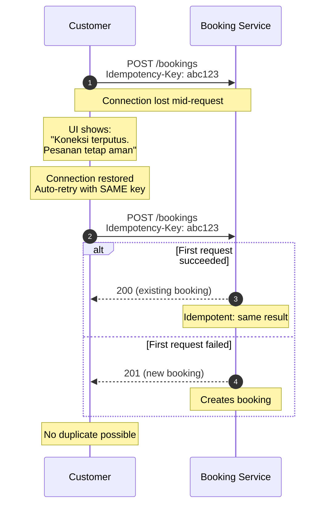
```mermaid
sequenceDiagram
    autonumber
    participant C as Customer
    participant B as Booking Service
    
    C->>B: POST /bookings<br/>Idempotency-Key: abc123
    Note over C,B: Connection lost mid-request
    
    Note over C: UI shows:<br/>"Koneksi terputus.<br/>Pesanan tetap aman"
    
    Note over C: Connection restored<br/>Auto-retry with SAME key
    
    C->>B: POST /bookings<br/>Idempotency-Key: abc123
    
    alt First request succeeded
        B-->>C: 200 (existing booking)
        Note over B: Idempotent: same result
    else First request failed
        B-->>C: 201 (new booking)
        Note over B: Creates booking
    end
    
    Note over C: No duplicate possible
```

---

## 10. Edit Order Flow

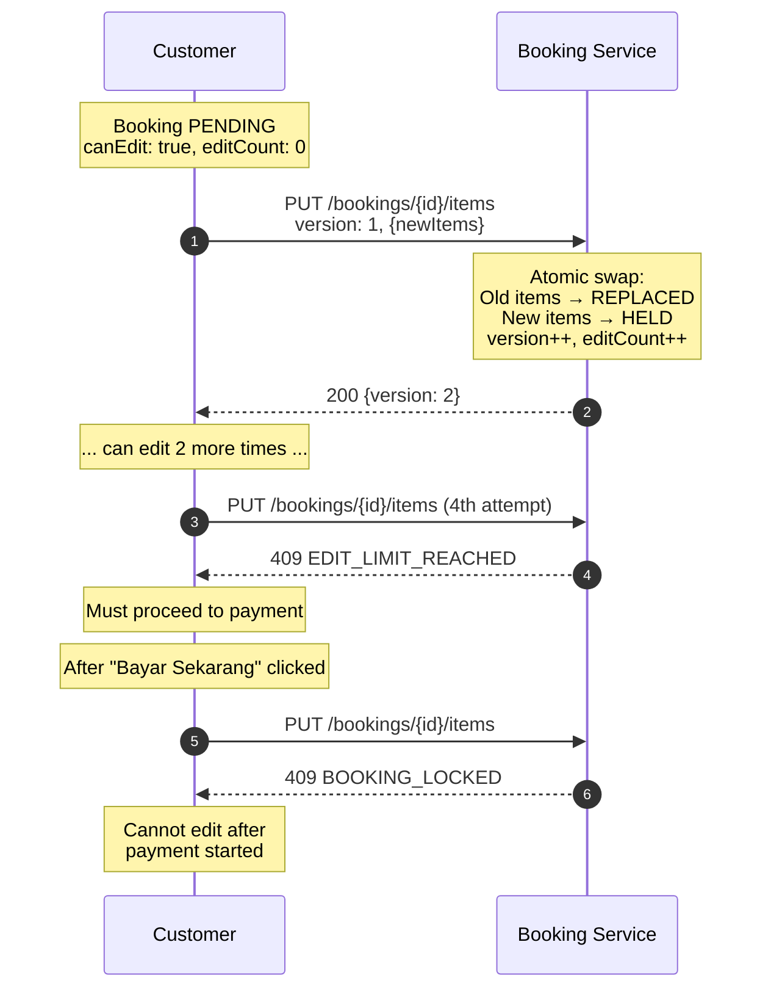
```mermaid
sequenceDiagram
    autonumber
    participant C as Customer
    participant B as Booking Service
    
    Note over C: Booking PENDING<br/>canEdit: true, editCount: 0
    
    C->>B: PUT /bookings/{id}/items<br/>version: 1, {newItems}
    
    Note over B: Atomic swap:<br/>Old items → REPLACED<br/>New items → HELD<br/>version++, editCount++
    
    B-->>C: 200 {version: 2}
    
    Note over C: ... can edit 2 more times ...
    
    C->>B: PUT /bookings/{id}/items (4th attempt)
    B-->>C: 409 EDIT_LIMIT_REACHED
    
    Note over C: Must proceed to payment
    
    Note over C: After "Bayar Sekarang" clicked
    C->>B: PUT /bookings/{id}/items
    B-->>C: 409 BOOKING_LOCKED
    
    Note over C: Cannot edit after<br/>payment started
```

---

## 11. Cancel Flow

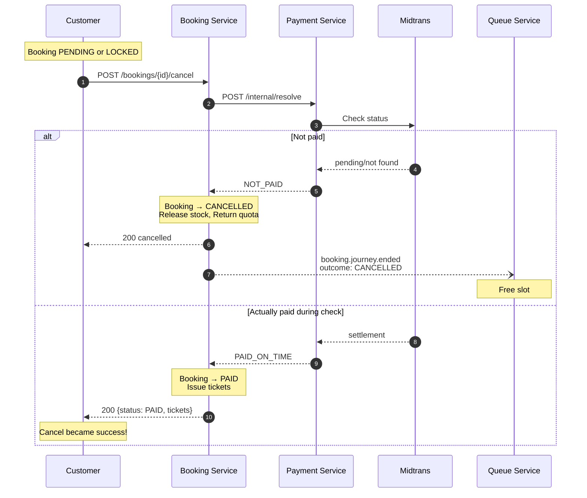
```mermaid
sequenceDiagram
    autonumber
    participant C as Customer
    participant B as Booking Service
    participant P as Payment Service
    participant M as Midtrans
    participant Q as Queue Service
    
    Note over C: Booking PENDING or LOCKED
    
    C->>B: POST /bookings/{id}/cancel
    
    B->>P: POST /internal/resolve
    P->>M: Check status
    
    alt Not paid
        M-->>P: pending/not found
        P-->>B: NOT_PAID
        
        Note over B: Booking → CANCELLED<br/>Release stock, Return quota
        B-->>C: 200 cancelled
        
        B--)Q: booking.journey.ended<br/>outcome: CANCELLED
        Note over Q: Free slot
        
    else Actually paid during check
        M-->>P: settlement
        P-->>B: PAID_ON_TIME
        
        Note over B: Booking → PAID<br/>Issue tickets
        B-->>C: 200 {status: PAID, tickets}
        
        Note over C: Cancel became success!
    end
```

---

## 12. State Machines

### Queue Entry States

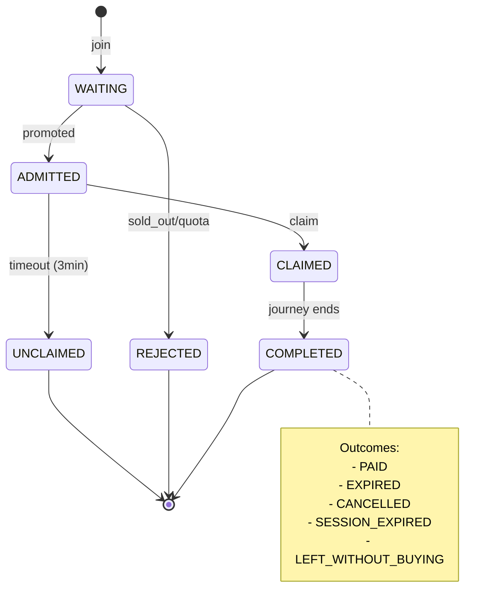
```mermaid
stateDiagram-v2
    [*] --> WAITING: join
    WAITING --> ADMITTED: promoted
    WAITING --> REJECTED: sold_out/quota
    
    ADMITTED --> CLAIMED: claim
    ADMITTED --> UNCLAIMED: timeout (3min)
    
    CLAIMED --> COMPLETED: journey ends
    UNCLAIMED --> [*]
    REJECTED --> [*]
    COMPLETED --> [*]
    
    note right of COMPLETED
        Outcomes:
        - PAID
        - EXPIRED
        - CANCELLED
        - SESSION_EXPIRED
        - LEFT_WITHOUT_BUYING
    end note
```

### Booking States

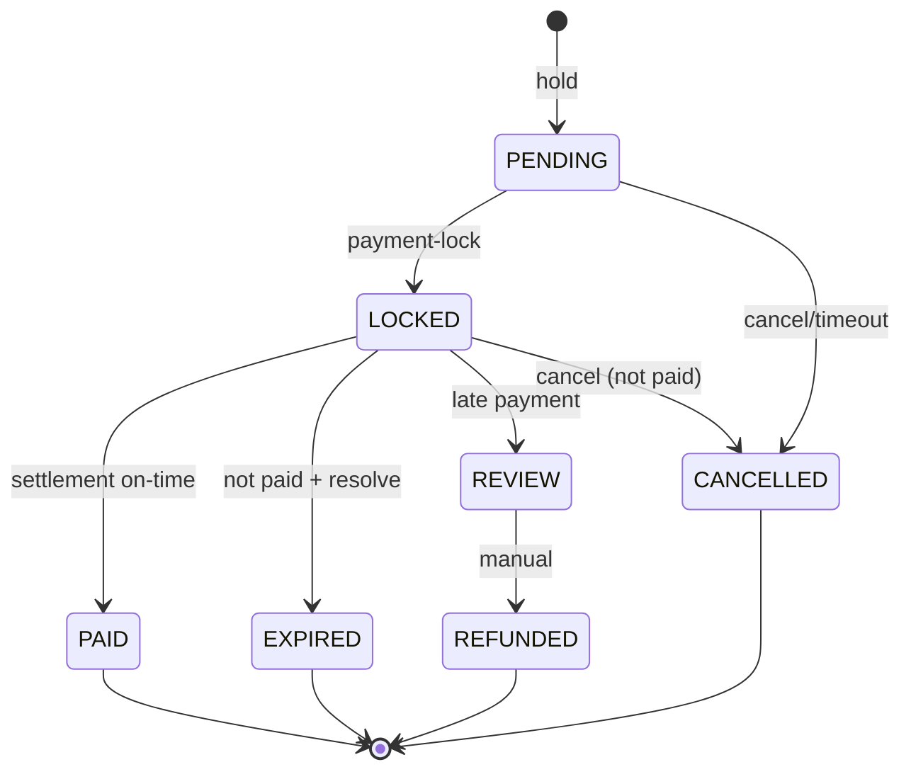
```mermaid
stateDiagram-v2
    [*] --> PENDING: hold
    PENDING --> LOCKED: payment-lock
    PENDING --> CANCELLED: cancel/timeout
    
    LOCKED --> PAID: settlement on-time
    LOCKED --> EXPIRED: not paid + resolve
    LOCKED --> REVIEW: late payment
    LOCKED --> CANCELLED: cancel (not paid)
    
    PAID --> [*]
    EXPIRED --> [*]
    REVIEW --> REFUNDED: manual
    REFUNDED --> [*]
    CANCELLED --> [*]
```

### Payment Attempt States

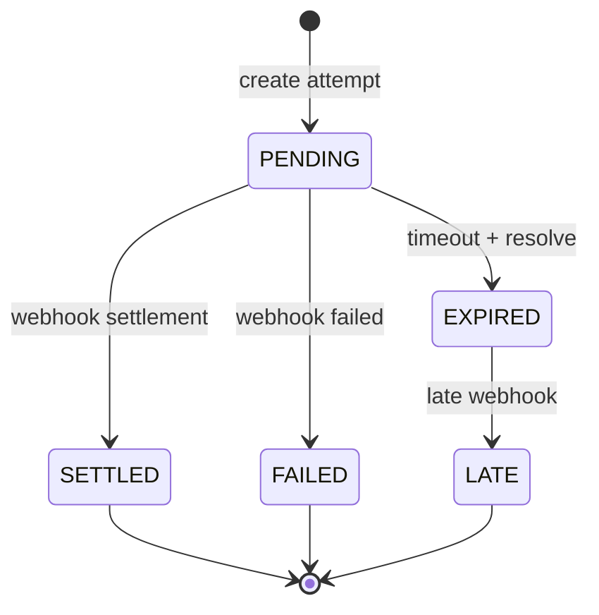
```mermaid
stateDiagram-v2
    [*] --> PENDING: create attempt
    
    PENDING --> SETTLED: webhook settlement
    PENDING --> FAILED: webhook failed
    PENDING --> EXPIRED: timeout + resolve
    
    EXPIRED --> LATE: late webhook
    
    SETTLED --> [*]
    FAILED --> [*]
    LATE --> [*]
```

---

## 13. Domain Events Flow

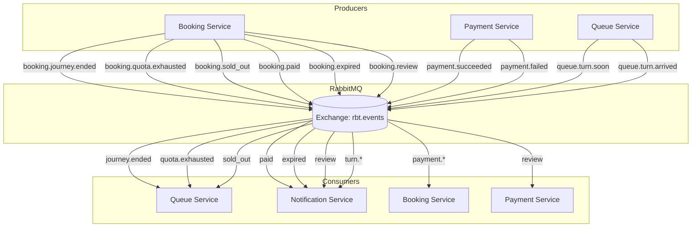
```mermaid
flowchart TB
    subgraph Producers
        B[Booking Service]
        P[Payment Service]
        Q[Queue Service]
    end
    
    subgraph RabbitMQ
        MQ[(Exchange: rbt.events)]
    end
    
    subgraph Consumers
        Q2[Queue Service]
        N[Notification Service]
        B2[Booking Service]
        P2[Payment Service]
    end
    
    B -->|booking.journey.ended| MQ
    B -->|booking.quota.exhausted| MQ
    B -->|booking.sold_out| MQ
    B -->|booking.paid| MQ
    B -->|booking.expired| MQ
    B -->|booking.review| MQ
    
    P -->|payment.succeeded| MQ
    P -->|payment.failed| MQ
    
    Q -->|queue.turn.soon| MQ
    Q -->|queue.turn.arrived| MQ
    
    MQ -->|journey.ended| Q2
    MQ -->|quota.exhausted| Q2
    MQ -->|sold_out| Q2
    
    MQ -->|paid| N
    MQ -->|expired| N
    MQ -->|review| N
    MQ -->|turn.*| N
    
    MQ -->|payment.*| B2
    MQ -->|review| P2
```

---

## 14. Service Dependencies

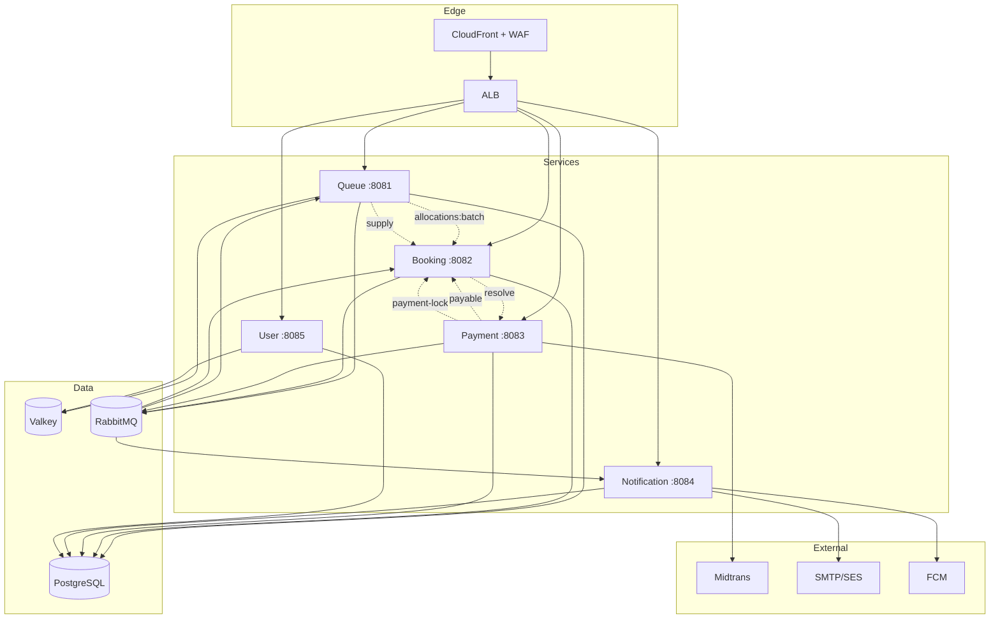
```mermaid
flowchart TD
    subgraph Edge
        CF[CloudFront + WAF]
        ALB[ALB]
    end
    
    subgraph Services
        Q[Queue :8081]
        B[Booking :8082]
        P[Payment :8083]
        N[Notification :8084]
        U[User :8085]
    end
    
    subgraph Data
        PG[(PostgreSQL)]
        VK[(Valkey)]
        MQ[(RabbitMQ)]
    end
    
    subgraph External
        MT[Midtrans]
        SMTP[SMTP/SES]
        FCM[FCM]
    end
    
    CF --> ALB
    ALB --> Q
    ALB --> B
    ALB --> P
    ALB --> N
    ALB --> U
    
    Q -.->|allocations:batch| B
    Q -.->|supply| B
    B -.->|resolve| P
    P -.->|payable| B
    P -.->|payment-lock| B
    
    Q --> VK
    Q --> PG
    B --> PG
    P --> PG
    P --> MT
    N --> PG
    N --> SMTP
    N --> FCM
    U --> PG
    U --> VK
    
    Q --> MQ
    B --> MQ
    P --> MQ
    MQ --> N
    MQ --> Q
    MQ --> B
```

---

## 15. Error Handling Decision Tree

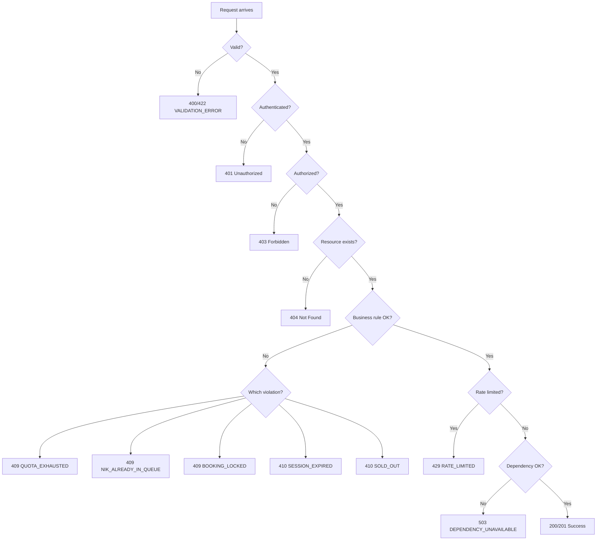
```mermaid
flowchart TD
    A[Request arrives] --> B{Valid?}
    B -->|No| C[400/422 VALIDATION_ERROR]
    B -->|Yes| D{Authenticated?}
    
    D -->|No| E[401 Unauthorized]
    D -->|Yes| F{Authorized?}
    
    F -->|No| G[403 Forbidden]
    F -->|Yes| H{Resource exists?}
    
    H -->|No| I[404 Not Found]
    H -->|Yes| J{Business rule OK?}
    
    J -->|No| K{Which violation?}
    K --> L[409 QUOTA_EXHAUSTED]
    K --> M[409 NIK_ALREADY_IN_QUEUE]
    K --> N[409 BOOKING_LOCKED]
    K --> O[410 SESSION_EXPIRED]
    K --> P[410 SOLD_OUT]
    
    J -->|Yes| Q{Rate limited?}
    Q -->|Yes| R[429 RATE_LIMITED]
    Q -->|No| S{Dependency OK?}
    
    S -->|No| T[503 DEPENDENCY_UNAVAILABLE]
    S -->|Yes| U[200/201 Success]
```

---

---

## 16. Journey J-06: Login with OTP

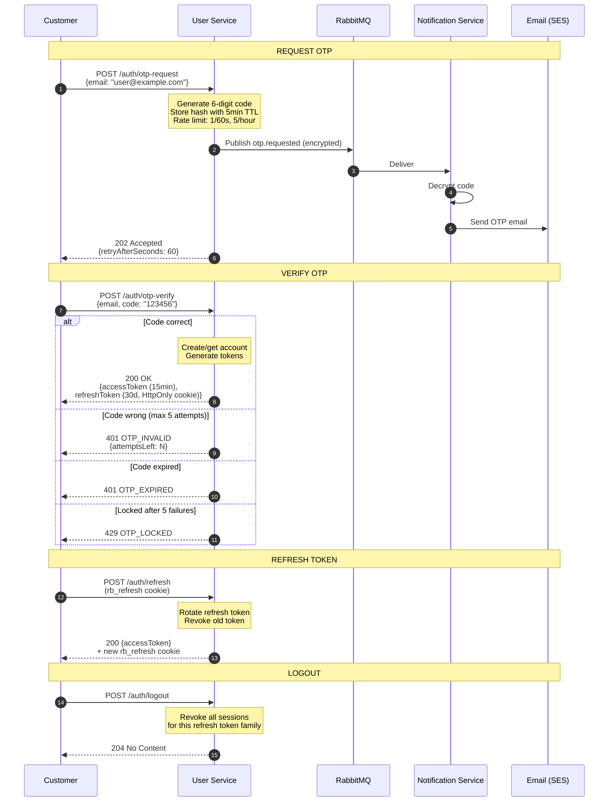
```mermaid
sequenceDiagram
    autonumber
    participant C as Customer
    participant U as User Service
    participant MQ as RabbitMQ
    participant N as Notification Service
    participant E as Email (SES)
    
    Note over C,E: REQUEST OTP
    C->>U: POST /auth/otp-request<br/>{email: "user@example.com"}
    Note over U: Generate 6-digit code<br/>Store hash with 5min TTL<br/>Rate limit: 1/60s, 5/hour
    U->>MQ: Publish otp.requested (encrypted)
    MQ->>N: Deliver
    N->>N: Decrypt code
    N->>E: Send OTP email
    U-->>C: 202 Accepted<br/>{retryAfterSeconds: 60}
    
    Note over C,E: VERIFY OTP
    C->>U: POST /auth/otp-verify<br/>{email, code: "123456"}
    
    alt Code correct
        Note over U: Create/get account<br/>Generate tokens
        U-->>C: 200 OK<br/>{accessToken (15min),<br/>refreshToken (30d, HttpOnly cookie)}
    else Code wrong (max 5 attempts)
        U-->>C: 401 OTP_INVALID<br/>{attemptsLeft: N}
    else Code expired
        U-->>C: 401 OTP_EXPIRED
    else Locked after 5 failures
        U-->>C: 429 OTP_LOCKED
    end
    
    Note over C,E: REFRESH TOKEN
    C->>U: POST /auth/refresh<br/>(rb_refresh cookie)
    Note over U: Rotate refresh token<br/>Revoke old token
    U-->>C: 200 {accessToken}<br/>+ new rb_refresh cookie
    
    Note over C,E: LOGOUT
    C->>U: POST /auth/logout
    Note over U: Revoke all sessions<br/>for this refresh token family
    U-->>C: 204 No Content
```

---

## 17. Journey J-07: Logged-in User Purchase (v5.4)

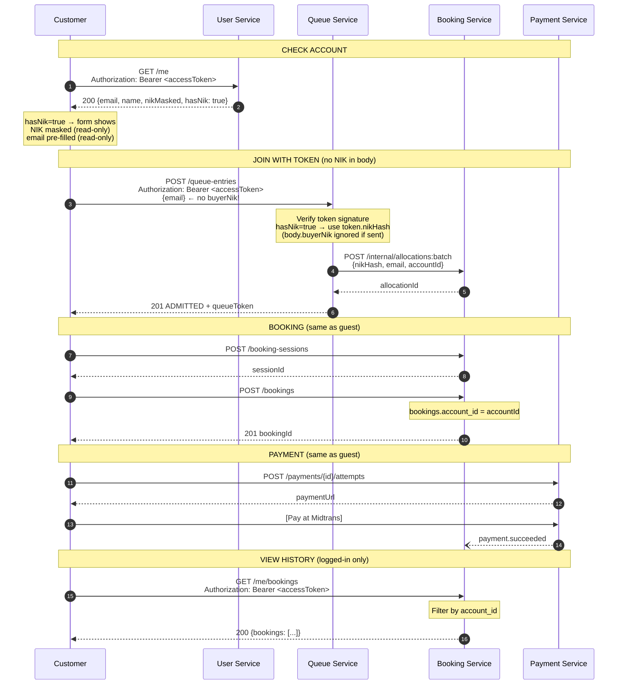
```mermaid
sequenceDiagram
    autonumber
    participant C as Customer
    participant U as User Service
    participant Q as Queue Service
    participant B as Booking Service
    participant P as Payment Service
    
    Note over C,P: CHECK ACCOUNT
    C->>U: GET /me<br/>Authorization: Bearer <accessToken>
    U-->>C: 200 {email, name, nikMasked, hasNik: true}
    
    Note over C: hasNik=true → form shows<br/>NIK masked (read-only)<br/>email pre-filled (read-only)
    
    Note over C,P: JOIN WITH TOKEN (no NIK in body)
    C->>Q: POST /queue-entries<br/>Authorization: Bearer <accessToken><br/>{email} ← no buyerNik!
    
    Note over Q: Verify token signature<br/>hasNik=true → use token.nikHash<br/>(body.buyerNik ignored if sent)
    
    Q->>B: POST /internal/allocations:batch<br/>{nikHash, email, accountId}
    B-->>Q: allocationId
    Q-->>C: 201 ADMITTED + queueToken
    
    Note over C,P: BOOKING (same as guest)
    C->>B: POST /booking-sessions
    B-->>C: sessionId
    C->>B: POST /bookings
    Note over B: bookings.account_id = accountId
    B-->>C: 201 bookingId
    
    Note over C,P: PAYMENT (same as guest)
    C->>P: POST /payments/{id}/attempts
    P-->>C: paymentUrl
    C->>P: [Pay at Midtrans]
    P--)B: payment.succeeded
    
    Note over C,P: VIEW HISTORY (logged-in only)
    C->>B: GET /me/bookings<br/>Authorization: Bearer <accessToken>
    Note over B: Filter by account_id
    B-->>C: 200 {bookings: [...]}
```

**Key design (SRS-F-27-10, PRD US-092):**
- Guest: form editable, body has `{buyerNik, email}`
- Logged-in (hasNik=true): form shows NIK masked + read-only, body has `{email}` only
- Logged-in (hasNik=false): form NIK editable, body has `{buyerNik, email}`
- Server: if `token.hasNik`, use `token.nikHash` directly (ignore body.buyerNik)
- Anti-scalper: nikHash used same way regardless of source (HMAC from body or from token)

---

## 18. Journey J-08: View Booking History

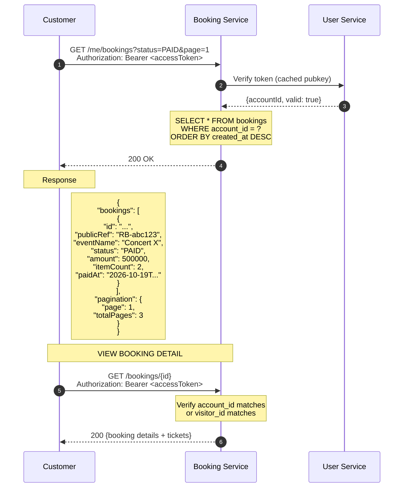
```mermaid
sequenceDiagram
    autonumber
    participant C as Customer
    participant B as Booking Service
    participant U as User Service
    
    C->>B: GET /me/bookings?status=PAID&page=1<br/>Authorization: Bearer <accessToken>
    
    B->>U: Verify token (cached pubkey)
    U-->>B: {accountId, valid: true}
    
    Note over B: SELECT * FROM bookings<br/>WHERE account_id = ?<br/>ORDER BY created_at DESC
    
    B-->>C: 200 OK
    
    Note over C: Response
    Note right of C: {<br/>  "bookings": [<br/>    {<br/>      "id": "...",<br/>      "publicRef": "RB-abc123",<br/>      "eventName": "Concert X",<br/>      "status": "PAID",<br/>      "amount": 500000,<br/>      "itemCount": 2,<br/>      "paidAt": "2026-10-19T..."<br/>    }<br/>  ],<br/>  "pagination": {<br/>    "page": 1,<br/>    "totalPages": 3<br/>  }<br/>}
    
    Note over C,B: VIEW BOOKING DETAIL
    C->>B: GET /bookings/{id}<br/>Authorization: Bearer <accessToken>
    
    Note over B: Verify account_id matches<br/>or visitor_id matches
    
    B-->>C: 200 {booking details + tickets}
```

---

## 19. Token Lifecycle Overview

```mermaid
flowchart TB
    subgraph Guest["Guest Flow (No Login)"]
        V1[Visit Site] --> VT[Visitor Token<br/>24h, cookie/header]
        VT --> JG[Join Queue]
        JG --> QT[Queue Token<br/>until journey ends]
        QT --> CL[Claim Turn]
        CL --> AT[Admission Token<br/>60s, one-time]
        AT --> BS[Booking Session]
    end
    
    subgraph Login["Login Flow (Optional)"]
        L1[Enter Email] --> OTP[OTP Request]
        OTP --> VER[Verify Code]
        VER --> ACC[Access Token<br/>15min, JWT]
        VER --> REF[Refresh Token<br/>30d, HttpOnly]
        ACC --> JL[Join Queue<br/>with accountId]
        REF --> ROT[Rotate on refresh]
    end
    
    subgraph Payment["Payment Flow"]
        BS --> PT[Payment Attempt]
        PT --> PPT[Page Token<br/>60s, one-time<br/>for mobile WebView]
    end
    
    style VT fill:#e1f5fe
    style QT fill:#e1f5fe
    style AT fill:#fff3e0
    style ACC fill:#e8f5e9
    style REF fill:#e8f5e9
    style PPT fill:#fff3e0
```

---

## 20. Guest vs Logged-in Comparison

```mermaid
flowchart LR
    subgraph Guest["Guest Checkout"]
        G1[Enter NIK + Email<br/>typed twice] --> G2[Join Queue]
        G2 --> G3[Purchase]
        G3 --> G4[Tickets via<br/>email link only]
    end
    
    subgraph LoggedIn["Logged-in User"]
        L1[Login with OTP] --> L2[NIK/Email<br/>pre-filled from account]
        L2 --> L3[Join Queue<br/>accountId attached]
        L3 --> L4[Purchase<br/>linked to account]
        L4 --> L5[View History<br/>GET /me/bookings]
    end
    
    subgraph Differences["Key Differences"]
        D1[Guest: No history]
        D2[Guest: Tickets only via email]
        D3[Logged-in: History available]
        D4[Logged-in: NIK must match account]
    end
```

---

## 21. OTP Security State Machine

```mermaid
stateDiagram-v2
    [*] --> NO_CHALLENGE: initial
    
    NO_CHALLENGE --> PENDING: request OTP
    
    PENDING --> VERIFIED: correct code
    PENDING --> PENDING: wrong code (< 5)
    PENDING --> LOCKED: wrong code (= 5)
    PENDING --> EXPIRED: TTL exceeded
    
    LOCKED --> NO_CHALLENGE: cooldown (5min)
    EXPIRED --> NO_CHALLENGE: request new
    
    VERIFIED --> [*]: tokens issued
    
    note right of PENDING
        attempts: 0..5
        TTL: 5 minutes
        resend: after 60s
    end note
    
    note right of LOCKED
        All tokens for email
        invalidated
    end note
```

---

## References

- PRD-RBT-001 v5.4 §6 (User Journeys J-01..J-05)
- SRS-RBT-001 v1.3 §3.2 (Functional Requirements)
- SRS-RBT-001 v1.3 §3.2.27 (User Service - Login OTP)
- HLD-AD-RBT-001 v1.6 §4.2 (Domain Events, Internal APIs)
- ADR-020 (User Service for optional login)
- SDD-*-001 (Per-service implementation details)
- TP-RBT-001 v1.4 (Test Cases TC-USR-01..12)
